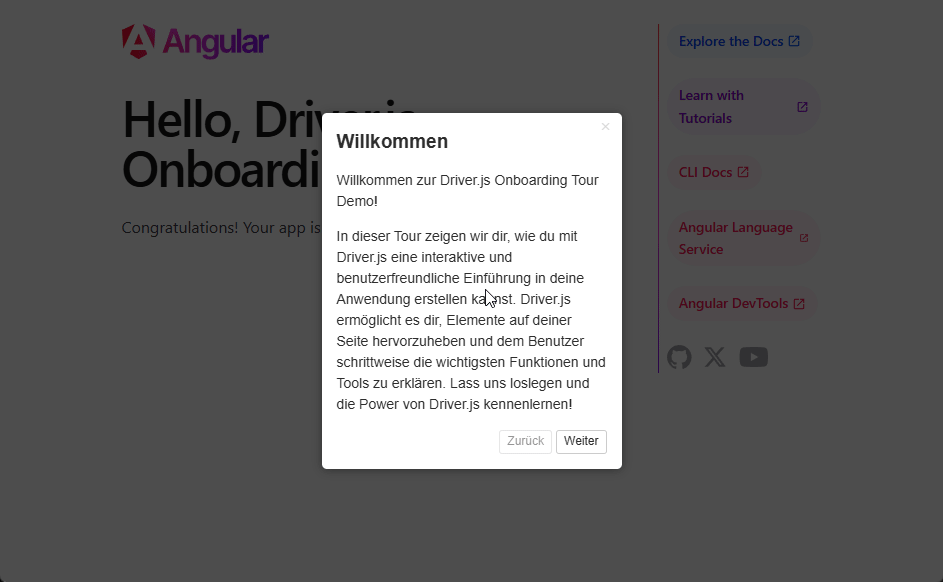

# Onboarding Demo mit Driver.js 🎓

Diese Angular 19 Demo zeigt, wie man **Onboarding**-Touren mit **Driver.js** umsetzt. 
Driver.js ermöglicht es, visuelle Touren zu erstellen, die Benutzer durch die wichtigsten Teile einer Anwendung führen. 
In diesem Beispiel wird eine Tour auf der Angular Landingpage verwendet, um die verschiedenen Links und Funktionen zu erklären.

## ✨ Features

- Interaktive **Onboarding-Tour** auf der Landingpage
- Verwendung von **Driver.js** zur Hervorhebung und Erklärung von Links und Features
- Anpassbare **Tour-Steps** für eine benutzerfreundliche Einführung

## 🛠️ Verwendete Technologien

- **Angular 19**
- **Driver.js** für Onboarding-Touren
- **TypeScript**

## 🚀 Lokales Setup

```
git clone https://github.com/ronnymundt/driverjs-onboarding-demo.git
cd driverjs-onboarding-demo
npm install
ng serve
```

## 🎥 Screencast


